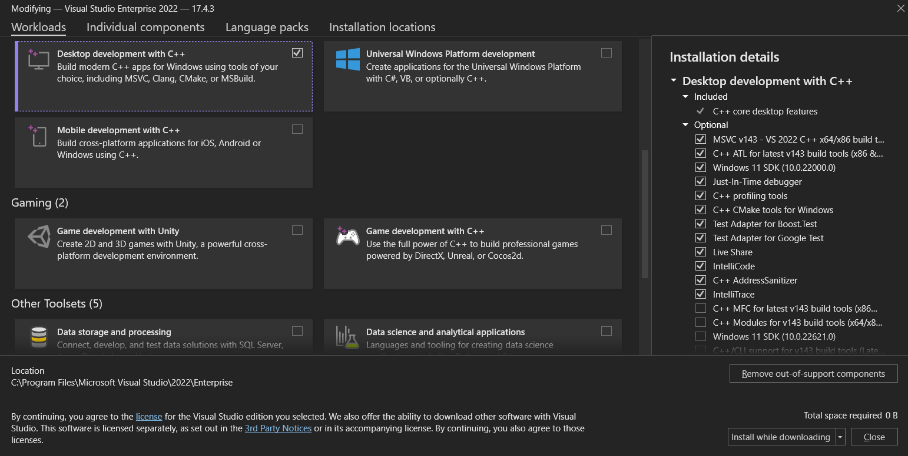
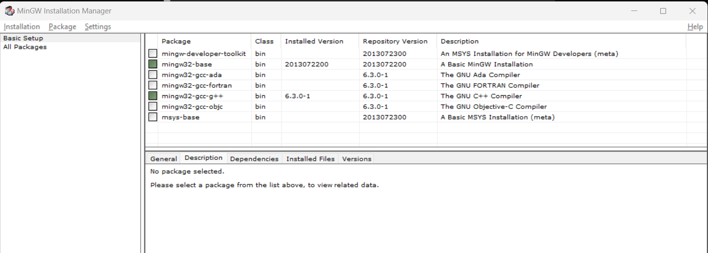

# Visual Studio
[Изтегли Visual Studio Community](https://visualstudio.microsoft.com/downloads/)
# VS Code
 1. [Изтегли Vs Code](https://code.visualstudio.com/download)

# Инсталация на Windows
## Visual Studio
1. Стартирайте Visual Studio Installer
2. Маркитай следното поле и инсталирай 

3. След като инсталацията приключи си готов да създадеш първия си проект!

## Vs Code
 1. Инсталирай Vs Code
 2. [Изтегли компилатор](https://sourceforge.net/projects/mingw/)
 3. Инсталирай MinGW, като при инсталацията маркираш следните полета:
 
 4. Тест
 ```
    g++ -v
 ```
 5. Добави [extensions](#vs-code-extensions)

# Ubuntu
1. Инсталирай Vs Code
 ```
    sudo apt install [path-to-file]
 ```
2. Исталиране на компилатор
```
    sudo apt install g++
```
3. Тест 
```
    g++ --version
```
4. Добави [extensions](#vs-code-extensions)


# Инсталация на Mac
## Vs Code
1. Инсталирай Vs Code
2. Отвори терминала и изпълни командата
```
xcode-select --install
```
3. тест
```
g++ --version
```


# VS code Extensions
Полезни VS code extensions може да откриеш [тук](https://marketplace.visualstudio.com/items?itemName=ms-vscode.cpptools-extension-pack)<br>
[C++ runner](https://marketplace.visualstudio.com/items?itemName=franneck94.c-cpp-runner) (не е задължителен)